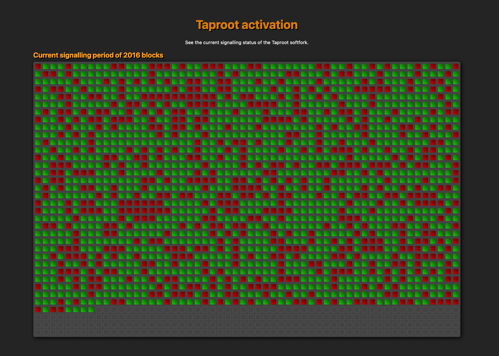

# Fork Explorer

Fork Explorer let's you see the status of a BIP9-style softfork. It relies on bitcoind and its JSON-RPC server.

# Build and run

You need [Deno](https://deno.land) to build and run this project. Deno is a new
Javascript environment, similar to Node.

0. Fix config file by duplicating `config/config.ts_TEMPLATE` to `config/config.ts` and setting
   bitcoind's JSON-RPC credentials up.
1. `./build-frontend`.
2. `./run-server`.
3. Done.

# License

MIT
