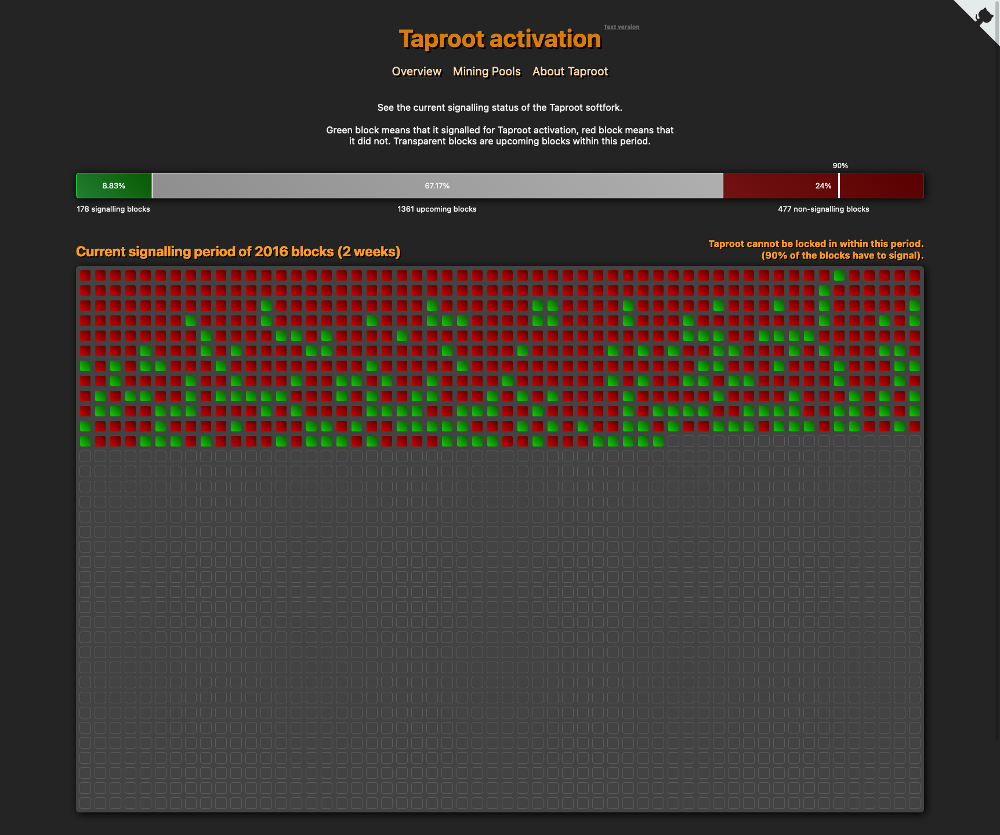

# Fork Explorer

Fork Explorer let's you see the status of a BIP9-style softfork. It relies on bitcoind and its JSON-RPC server.



## Build and Run

You need [Deno](https://deno.land) version <= v1.9.2 to build and run this project. Deno is a new
Javascript environment, similar to Node.

0. Fix config file by duplicating `config/config.ts_TEMPLATE` to `config/config.ts` and setting
   bitcoind's JSON-RPC credentials up.
1. `./build-frontend.sh`.
2. `./run-server.sh`.
3. Done.

### Running without bitcoind installed (faked data mode):

If you want to build and run fork-explorer without bitcoind, you can start one of the two
fake modes available:

Set `mode: "fake"` or `mode: "fake-backend"` in your `config/config.ts`.

`fake`: Backend will generate fake blocks

`fake-frontend`: Frontend will generate fake blocks, this mode works in conjuction with `./frontend-dev-server.sh`

## Commit and Code-Style

Follow the code style of the file you are working in.

This project uses [Prettier](https://prettier.io/) for code formatting.
To contribute, install and activate the Prettier extension to your editor of choice.

For commits, make descriptive and atomic git commits.
You can prefix the page or relevant code you are working with, for example on frontend change:

```
index: Add 90% indicator to Progress Bar
```

Or for the backend:

```
blocks: Make fakemode not depend on bitcoind
```

# License

MIT
